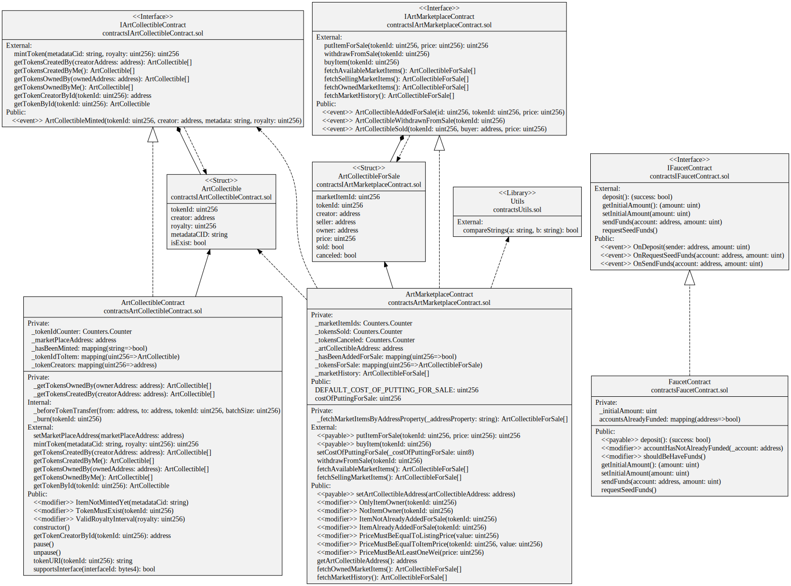

# Art Collectibles Marketplace

An NFT Marketplace for trading Art Collectibles built with Hardhat and Solidity
It comes with a contract generated by [OpenZeppelin Wizard](https://wizard.openzeppelin.com/), a test for that contract, and a script that deploys that contract.

NFTs and digital collectibles are growing popular as the web3 space continues to make significant advancements in the blockchain arena. The enormous popularity of NFTs like Cryptokitties and Bored APE pushed investors to purchase ERC721-compatible digital collectibles.

Tools like the OpenZeppelin Wizard that offers developers click and write functionalities to create composable and secure smart contracts in no time, used with Web3 developer tools like Alchemy, make the experience of writing a deploying code on the blockchain easy, fast, and reliable like never before

<p align="center">
  
  
  
  
  
  
</p>

## UML Design Diagram

Complete UML diagram of decentralized application design.




## Installing dependencies

```
npm install
```

## Testing the contract

```
npm test
```

## Deploying the contract

You can target any network from your Hardhat config using:

```
npx hardhat run --network <network-name> scripts/deploy.ts
```
