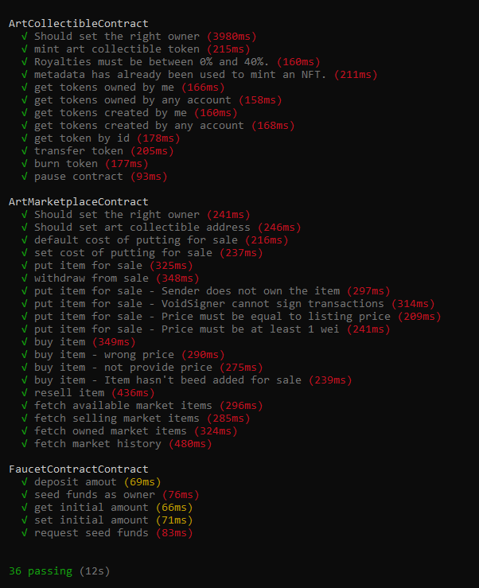
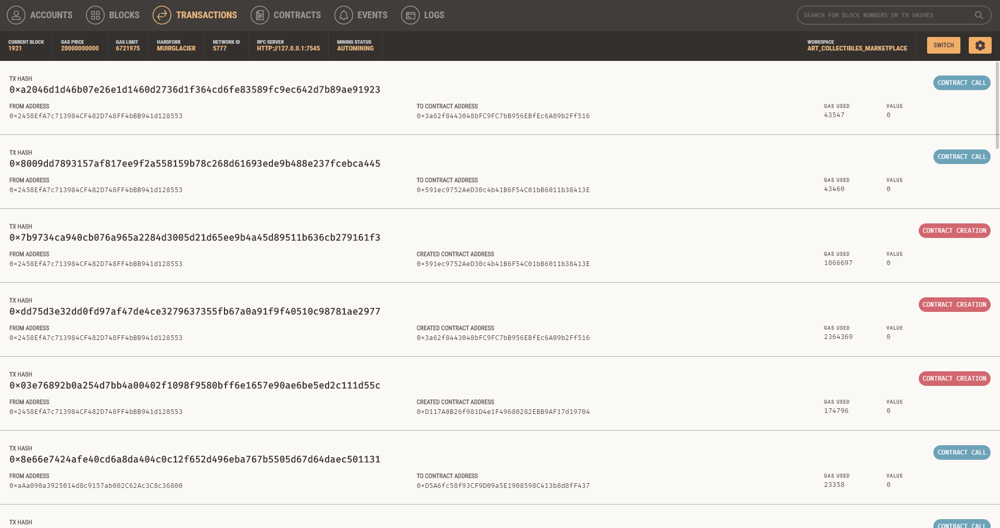
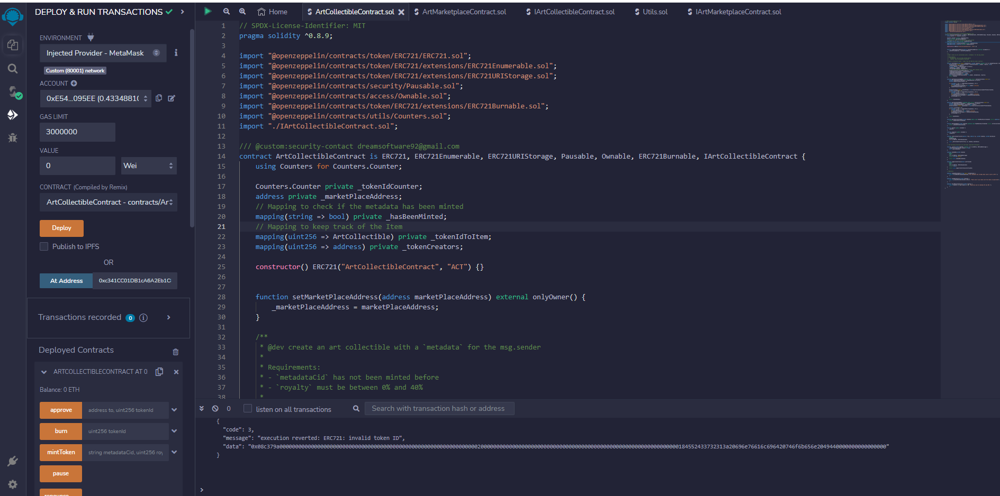

# Art Collectibles Marketplace

An NFT Marketplace for trading Art Collectibles built with Hardhat and Solidity
It comes with a NFT ERC721 contract generated by [OpenZeppelin Wizard](https://wizard.openzeppelin.com/), a test for that contract, and a script that deploys that contract.

NFTs and digital collectibles are growing popular as the web3 space continues to make significant advancements in the blockchain arena. The enormous popularity of NFTs like Cryptokitties and Bored APE pushed investors to purchase ERC721-compatible digital collectibles.

Tools like the OpenZeppelin Wizard that offers developers click and write functionalities to create composable and secure smart contracts in no time, used with Web3 developer tools like Alchemy, make the experience of writing a deploying code on the blockchain easy, fast, and reliable like never before

<p align="center">
  
  
  
  
  
  
</p>

## UML Design Diagram

Complete UML diagram of decentralized application design.


## Configuring the project

The first step is to clone the repository and execute the following command to install all the required modules

```
npm install
```

After that it will be necessary to create an account in Alchemy, infura or another similar service in order to configure the network on which the Dapp will be deployed.

In my case, I have created a project in Alchemy and I have created a `secret.json` file to configure the deployment over the Mumbai testnet as you can see in the `hardhat.config.ts` file of the project:

```
import { HardhatUserConfig } from "hardhat/config";
import "@nomicfoundation/hardhat-toolbox";
const secret = require('./.secret.json');

const config: HardhatUserConfig = {
  solidity: {
    version: "0.8.9",
    settings: {
      optimizer: {
        enabled: true,
      },
    },
  },
  networks: {
    hardhat: {},
    ganache: {
      url: "http://127.0.0.1:7545",
      allowUnlimitedContractSize: true,
      gas: 2100000,
      gasPrice: 8000000000
    },
    mumbai: {
      url: `https://polygon-mumbai.g.alchemy.com/v2/${secret.projectId}`,
      accounts: [secret.accountPrivateKey]
    }
  }
};

export default config;
```

## Running the test suite

The project has a set of tests to validate the correct behaviour of the contracts and the interaction between them.
You can run the following command to launch the test suite on the local EVM:

```
npx hardhat test
```


You can also use ganache to carry out the tests, for this it is only necessary to use the network option

```
npx hardhat --network ganache test
```


## Deploying contracts

You can target any network from your Hardhat config using:

```
npx hardhat run --network <network-name> scripts/deploy.ts
```

The project has been deployed on the Mumbai testnet, the addresses of the contracts are as follows:

```
Faucet contract deployed to 0x2D17A6B4d65EC3eb223561A5Cc7FC3b1f67D81cD
ArtMarketplace contract deployed to 0x8390A55EeEC02E04013835aA4b182d37C27331AB
ArtCollectible contract deployed to 0x2a230316fe8C5411f70Fe83BC6A3FEb30D68389A
```
You can use the Remix IDE to interact with the contracts at those addresses:



## Visitors Count


## Please Share & Star the repository to keep me motivated.
  <a href = "https://github.com/sergio11/art_collectibles_marketplace/stargazers">
     
  </a>
  <a href = "https://twitter.com/SergioReact418">
     
  </a>
