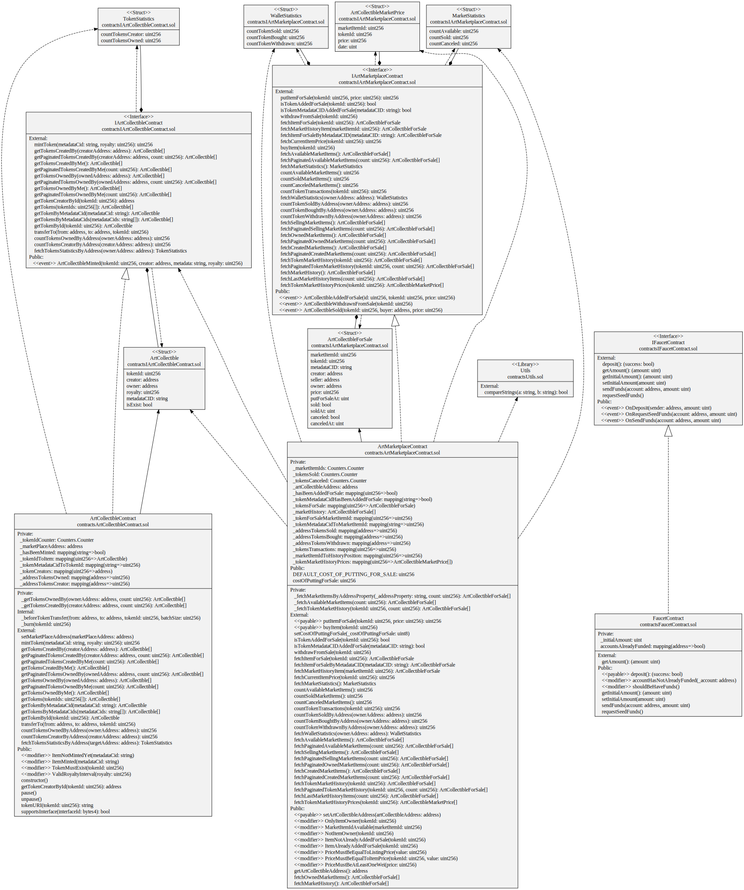

# Art Collectibles Marketplace

An NFT Marketplace for trading Art Collectibles built with Hardhat and Solidity
It comes with a contract generated by [OpenZeppelin Wizard](https://wizard.openzeppelin.com/), a test for that contract, and a script that deploys that contract.

<p align="center">
  
  
  
</p>

## UML Design Diagram

Complete UML diagram of decentralized application design.




## Installing dependencies

```
npm install
```

## Testing the contract

```
npm test
```

## Deploying the contract

You can target any network from your Hardhat config using:

```
npx hardhat run --network <network-name> scripts/deploy.ts
```
